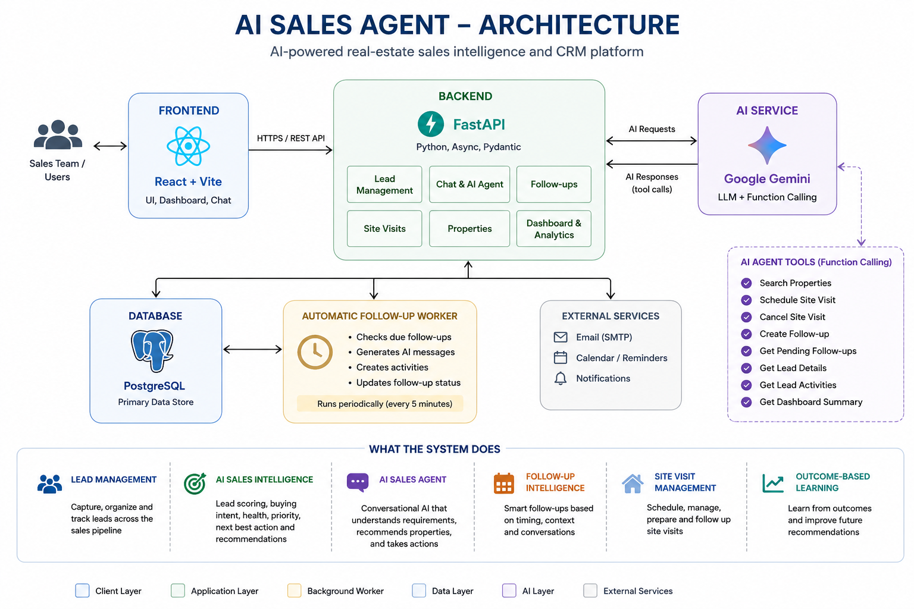

# AI Sales Agent

An AI-powered real-estate sales intelligence and CRM platform built with React, FastAPI, PostgreSQL, and Google Gemini.


## 🌐 Live Demo

[Open AI Sales Agent](https://ai-sales-agent-frontend-fg0c.onrender.com)


## Architecture



The system helps sales teams manage leads, understand customer intent, recommend sales actions, manage follow-ups and site visits, and learn from real-world sales outcomes.

---

## 🚀 Features

### Lead Management

- Create and manage real-estate leads
- Store customer requirements, budget, location, and property preferences
- Track lead pipeline stages
- Maintain communication and activity history

### 🧠 AI Sales Intelligence

The platform analyzes lead information and sales activity to provide:

- Lead scoring
- Sales health
- Buying intent
- Lead priority
- Next Best Action
- Sales recommendations
- Risk signals
- Recommended sales focus
- Suggested customer messages

Example:

```text
Lead Score: 60
Health: HOT
Priority: HIGH
Pipeline: SITE_VISIT
Buying Intent: MEDIUM
Next Best Action: Prepare For Site Visit


🤖 AI Sales Agent

Customers can interact with the AI sales agent conversationally.

The agent can:

Understand property requirements
Search available properties
Recommend suitable properties
Schedule site visits
Cancel site visits
Create follow-ups
Retrieve pending follow-ups
Provide sales-related responses

The AI uses tool/function calling to execute supported sales operations through the backend.

📈 Outcome-Based Sales Learning

The system records the outcome of sales actions.

Supported outcomes include:

Successful
Customer Interested
Customer Declined
No Response
Rescheduled
Converted
Lost

Historical outcomes are used to calculate:

Historical positive rate
Learning score
Learning confidence
Adaptive action score

This creates a feedback loop between sales activity and future recommendations.

🔄 Outcome-Aware Next Action

The recommendation engine can use previous sales outcomes to influence the next recommended action.

Example progression:

Contact Lead
      │
      ▼
Customer Interested
      │
      ▼
Recommend Properties
      │
      ▼
Customer Interested
      │
      ▼
Schedule Site Visit
      │
      ▼
Prepare For Site Visit

Negative outcomes do not blindly force a new action.

Deterministic lead-health and pipeline rules remain authoritative, while historical outcomes influence the recommendation layer.

📅 Follow-Up Intelligence

The system manages scheduled customer follow-ups.

Follow-up intelligence can determine whether the agent should:

Follow up now
Wait
Follow up before a site visit
Follow up after a site visit
Continue monitoring

The AI can also create a follow-up when the customer explicitly provides a date and time.

Example:

Customer:
"Please remind me to follow up tomorrow at 10 AM."

        ↓

AI Agent

        ↓

Follow-up created
Date: Tomorrow
Time: 10:00 AM
Status: Pending
🏠 Property Matching

The AI agent can search properties based on customer requirements such as:

Location
Budget
BHK
Property type
Other property preferences

Example:

Requirement:
2 BHK in Noida
Budget: ₹70 lakh

        ↓

Property Search

        ↓

Matching Properties
📍 Site Visit Management

The platform supports the site-visit lifecycle:

Schedule
   ↓
Scheduled
   ↓
Prepare For Site Visit
   ↓
Completed / Cancelled
   ↓
Follow-up / Reschedule

The AI can schedule and cancel site visits through backend tools.

Site-visit activity also influences lead pipeline and sales intelligence.

🏗️ Architecture
                    ┌──────────────────────┐
                    │    React Frontend    │
                    │       Vite           │
                    └──────────┬───────────┘
                               │
                               │ REST API
                               ▼
                    ┌──────────────────────┐
                    │    FastAPI Backend   │
                    │                      │
                    │  Lead Management     │
                    │  Chat                │
                    │  Follow-ups          │
                    │  Site Visits         │
                    │  Dashboard           │
                    │  Properties          │
                    └──────────┬───────────┘
                               │
              ┌────────────────┼────────────────┐
              │                │                │
              ▼                ▼                ▼
       ┌──────────────┐ ┌──────────────┐ ┌──────────────┐
       │ AI Agent     │ │ Intelligence │ │ PostgreSQL   │
       │ + Tools      │ │ Services     │ │ Database     │
       └──────┬───────┘ └──────────────┘ └──────────────┘
              │
              ▼
       ┌──────────────┐
       │ Google Gemini│
       │     AI       │
       └──────────────┘
🧠 AI Intelligence Pipeline
Lead Data
    │
    ▼
Lead Scoring
    │
    ▼
Sales Health
    │
    ▼
Deterministic Next Best Action
    │
    ▼
Previous Sales Outcome
    │
    ▼
Outcome-Aware Recommendation
    │
    ▼
Historical Learning
    │
    ▼
Adaptive Score + Confidence
    │
    ▼
Final Sales Recommendation
🗃️ Data Model

The main sales relationship is:

Lead
 │
 ├── Conversations
 ├── Communications
 ├── Follow-ups
 ├── Site Visits
 └── Sales Action Outcomes

Sales Action Outcomes provide the feedback used by the learning layer.

🛠️ Technology Stack
Frontend
React
Vite
JavaScript
REST API
Backend
Python
FastAPI
SQLAlchemy
Pydantic
Uvicorn
Database
PostgreSQL
AI
Google Gemini
google-genai
Deployment
Render
Render PostgreSQL
📂 Project Structure
AI-agent/
│
├── backend/
│   └── app/
│       │
│       ├── ai/
│       │   ├── agent.py
│       │   └── tools.py
│       │
│       ├── models/
│       │   ├── lead.py
│       │   ├── conversation.py
│       │   ├── property.py
│       │   ├── follow_up.py
│       │   ├── site_visits.py
│       │   ├── communication.py
│       │   └── sales_action_outcome.py
│       │
│       ├── routers/
│       │   ├── leads.py
│       │   ├── chat.py
│       │   ├── follow_ups.py
│       │   ├── site_visits.py
│       │   ├── dashboard.py
│       │   ├── properties.py
│       │   ├── activity.py
│       │   └── voice.py
│       │
│       └── services/
│           ├── lead_scoring.py
│           ├── lead_health.py
│           ├── lead_opportunity.py
│           ├── sales_recommendation.py
│           ├── sales_performance.py
│           ├── follow_up_intelligence.py
│           ├── follow_up_service.py
│           ├── property_matching.py
│           ├── communication.py
│           └── action_learning.py
│
├── frontend/
│   └── src/
│       └── App.jsx
│
├── requirements.txt
└── README.md
⚙️ Local Development
Backend

Create a virtual environment:

python -m venv venv

Activate it on Windows:

venv\Scripts\Activate.ps1

Install dependencies:

pip install -r requirements.txt

Start the backend:

cd backend
uvicorn app.main:app --reload --port 8001
Frontend

Open another terminal:

cd frontend
npm install
npm run dev
🔐 Environment Variables

The backend requires environment variables such as:

DATABASE_URL
GEMINI_API_KEY
FRONTEND_URL

Never commit API keys, database passwords, or other secrets to Git.

🔁 Automatic Follow-Up Worker

The backend includes an automatic follow-up worker.

The worker periodically checks pending follow-ups and processes those that become due.

High-level flow:

Pending Follow-up
       │
       ▼
Due Check
       │
       ▼
Process Follow-up
       │
       ▼
Communication Attempt
       │
       ▼
Update Follow-up Status
🌐 Production Deployment

The application is deployed using Render.

┌─────────────────────┐
│   React Frontend    │
└──────────┬──────────┘
           │
           ▼
┌─────────────────────┐
│   FastAPI Backend   │
└──────────┬──────────┘
           │
           ▼
┌─────────────────────┐
│ PostgreSQL Database │
└─────────────────────┘
🧪 Production Validation

The system has been validated against the production deployment for:

Lead retrieval
Sales recommendation generation
Lead scoring
Sales health
Outcome-based learning
Adaptive scoring
Follow-up creation
Follow-up intelligence
Property matching
Site-visit scheduling
Site-visit cancellation
Outcome-aware sales recommendations
💡 Engineering Highlights

This project demonstrates practical experience with:

Full-stack application development
REST API development with FastAPI
PostgreSQL database design
SQLAlchemy ORM
AI function/tool calling
AI-assisted business workflows
Lead scoring systems
Rule-based decision engines
Outcome-driven recommendation logic
Feedback loops for AI systems
Automated background processing
Site-visit lifecycle management
Production deployment
Debugging and iterative system development
🔮 Future Improvements

Potential improvements include:

More advanced sales outcome modeling
Better action-to-outcome correlation
Advanced property ranking
More detailed sales analytics
AI evaluation and observability
Role-based access control
Improved recommendation experimentation
More granular customer journey analytics
👨‍💻 Author

Built as a portfolio project demonstrating full-stack development, backend engineering, AI integration, database design, and intelligent business workflow automation.


